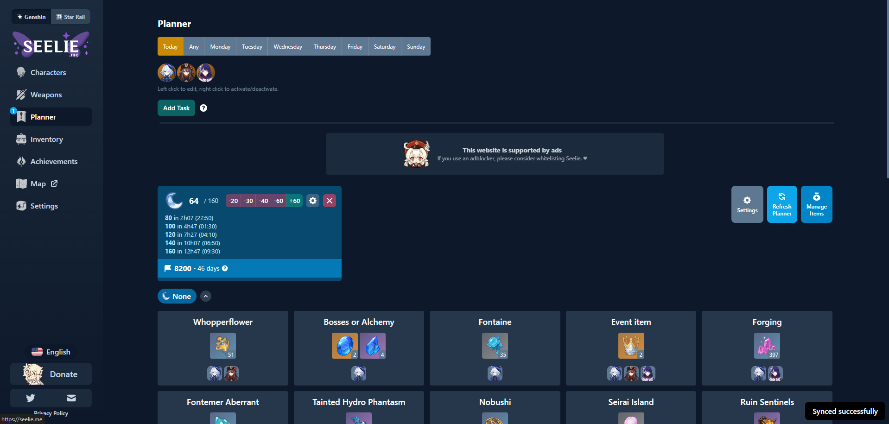
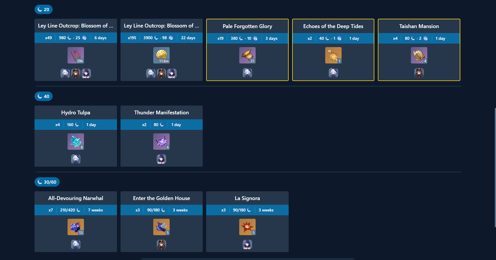

# DMIT2008 Report: Thinking in React
By: Andrew Ng<br>
I am going to do a report on a website I frequent everyday: The [Seelie.me](https://seelie.inmagi.com/planner) planner page for a mock representation on how I assume it will work if I were to try to implement it in React.

### Start with a Mock
Here is the page I am going to be analyzing.
<!-- Insert Page Images Here -->



Functionality on the page:
* Filtering based on the day of the week
* Show/Hide the characters and weapons to display
* Time based task tracker adding/editing/removing tasks
* Time based Resin tracker that shows how much you have at a given moment
* Required resources tracker based on what I can gather on the specified filtered day for my required characters and weapons
* Nav (Left) that takes you to a different pages to look at the different tabs
* Clicking on a character brings up a menu that allows you to change the current and desired level you wish to make them
* Clicking on a material brings up a menu that allows you to change the current amount of that material and it's upgrades/downgrades that you own, which will update the inventory in the background

You would need to navigate to other menus on the left to create the initial character/weapon and what you currently have compared to what you desire, and to have your inventory initially set up.

If I were to implement this myself I would use a json api that would track characters, weapons, and what is requried for them. This json file is then broken down, where the current level and desired level are compared, getting the difference, then taking that compared to what is currently on hand, then taking that difference to output onto the screen what is required for the user to do to get all those needed materials.

```json
[
	{
		"id": 608340167,
		"user": {
			"name": "Serpag",
			"account": "Main",
			"world-level": 8
		},
		"characters": [
			{
				"name": "Hu Tao",
				"element": "Pyro",
				"current-level": 80,
				"ascension-level": 6,
				"desired-level": 90,
				"talents": {
					"normal-current-level": 8,
					"normal-desired-level": 10,
					"skill-current-level": 8,
					"skill-desired-level": 10,
					"burst-current-level": 8,
					"burst-desired-level": 10,
				},
				"weapon-type": "polearm",
				"weapon": {
					"name": "Staff of Homa",
					"current-level": 90,
					"ascension-level": 6,
					"desired-level": 90
				}
			},
			{
				"name": "Furina",
				"element": "Hydro",
				"current-level": 50,
				"ascension-level": 3,
				"desired-level": 80,
				"talents": {
					"normal-current-level": 2,
					"normal-desired-level": 10,
					"skill-current-level": 6,
					"skill-desired-level": 10,
					"burst-current-level": 8,
					"burst-desired-level": 10,
				},
				"weapon-type": "sword",
				"weapon": {
					"name": "Splendor of Tranquil Waters",
					"current-level": 70,
					"ascension-level": 5,
					"desired-level": 90
				}
			},
			{
				"name": "Raiden Shogun",
				"element": "Electro",
				"current-level": 70,
				"ascension-level": 5,
				"desired-level": 90,
				"talents": {
					"normal-current-level": 6,
					"normal-desired-level": 6,
					"skill-current-level": 8,
					"skill-desired-level": 10,
					"burst-current-level": 8,
					"burst-desired-level": 10,
				},
				"weapon-type": "polearm",
				"weapon": {
					"name": "Engulfing Lightning",
					"current-level": 80,
					"ascension-level": 5,
					"desired-level": 90
				}
			}
		],
		"inventory": { // Not an exhaustive list of all the items in the game, only the ones that the characters have chosen to display use
			"gold": 3000000,
			"experience-books": { // Books to level characters
				"tier-1": 5,
				"tier-2": 250,
				"tier-3": 420
			},
			"weapon-experience": { // Materials to level weapons
				"tier-1": 40,
				"tier-2": 100,
				"tier-3": 500
			},
			"nectar": { // Hu Tao and Furina overworld material
				"tier-1": 100,
				"tier-2": 100,
				"tier-3": 100
			},
			"handguard": { // Raiden Shogun Overworld Material
				"tier-1": 0,
				"tier-2": 0,
				"tier-3": 0
			},
			"chunk": { // Furina Weapon Overworld Material
				"tier-1": 10,
				"tier-2": 10,
				"tier-3": 0
			},
			"tainted-water": { // Second Furina Weapon Overworld Material
				"tier-1": 20,
				"tier-2": 20,
				"tier-3": 0
			},
			"tartaglia-material": { // Weekly Boss Material
				"material-1": 2, // Tusk of Monoceros Caeli
				"material-2": 7, // Shard of a Foul Legacy - Hu Tao's Material
				"material-3": 4 // Shadow of the Warrior
			},
			"signora-material": { // Weekly Boss Material
				"material-1": 3, // Molten Moment - Raiden Shogun Material
				"material-2": 5, // Hellfire Butterfly
				"material-3": 4 // Ashen Heart
			},
			"whale-material": { // Weekly Boss Material
				"material-1": 3, // Lightless Silk String
				"material-2": 4, // Lightless Eye of the Maelstrom
				"material-3": 3 // Lightless Mass - Furina Material
			},
			"boss-items": {
				"storm-beads": 16, // Raiden Shogun boss Material
				"water-that-failed": 32 // Furina boss Material
			},
			"Gems": [
				{
					"hydro": { // Furina Ascension Gem
						"tier-1": 4,
						"tier-2": 4,
						"tier-3": 4,
						"tier-4": 4
					}
				},
				{
					"electro": { // Raiden Shogun Ascension Gem
						"tier-1": 4,
						"tier-2": 4,
						"tier-3": 4,
						"tier-4": 4
					}
				}
			],
			"diligence-book": { // Hu Tao Talent book
				"tier-1": 40,
				"tier-2": 40,
				"tier-3": 40
			},
			"light-book": { // Raiden Shogun Talent Book
				"tier-1": 30,
				"tier-2": 40,
				"tier-3": 20
			},
			"justice-book": { // Furina Talent Book
				"tier-1": 0,
				"tier-2": 0,
				"tier-3": 0
			},
			"crown": 6, // To get talents to lvl 10
			"masks": { // Raiden Shogun Weapon Ascension Material
				"tier-1": 0,
				"tier-2": 0,
				"tier-3": 0,
				"tier-4": 0
			},
			"pure-sacred-dewdrop": { // Furina Weapon Ascension Material
				"tier-1": 12,
				"tier-2": 17,
				"tier-3": 4,
				"tier-4": 2
			}
		}
	}
]
```
And somewhere would be a list of items that each character needs and the amount of items needed for each level of the characters, talents and weapons.

### Break the UI into a Component Hierarchy
Here is a image of the component breakdown.
<!-- Insert images here -->


Below is the breakdown of the components of the images above in a nested hiearchy.
* The Entire Application (Pink)
  * Left Nav (Black) - Nav Prop
    * Navigation Buttons (Gray)
  * Planner Page (Dark Gray)
    * Weekday Selector (Light Gray)
    * Character Filter (Light Pink)
      * Individual Characters (Dark Pink) - Icon Prop
    * Task Tracker (Green)
      * Add New Task
      * Current Tasks
      * Finished Tasks
    * Resin Tracker (Light Blue)
      * Buttons to modify how much resin you currently have to adjust the time until full
    * Interaction Buttons (Blue)
      * Settings
      * Refresh Planner
      * Custom requirements
    * Resource Tracker (Yellow) - Resource Props
      * 0 Resin (Exploration) Resources (Orange) - 0 Resin Resources
      * 20 Resin Resources (Light Yellow) - 20 Resin Resources
      * 40 Resin Resources (Puke Green) - 40 Resin Resources
      * 30/60 Resin Resources (Dark Red) - 30/60 Resin Resources

And inside each individual resource tracker is a singular resource that you are short of, and the characters that need them to get stronger.


* Resource Tracker (Red)
  * Resourse Origin (Black)
  * Resin Needed (Light Blue)
  * Items Needed (Yellow)
    * Tiers of items (Orange)
  * Characters that need this specific resource (Gray)
    * Individual Characters (White)

You can click on the individual character to bring up a menu, in which you can set the current and desired values of their level, talents, and weapon.


### Minimal Representation of State
Based on teh functionality above here's the minimal representation of state:
* The Resin tracker has a useEffect on the first number (in this case 64) where you can change it to better reflect the current amount of resin you have right now
* The Resin tracker has a useEffect on it's buttons where if you press them you change the current resin value.
* The Resource tracker lists have a useState where it will store all of the resources you need and the characters that need them
* Each resource has a useEffect on it where it detects if it has been changed, and then changes the displayed reources required.
* I did not include character editing because you can do that on another page that is more dedicated to adding and removing characters.

### Static Mockup
I did not include a static mockup as I was too busy to make one.


